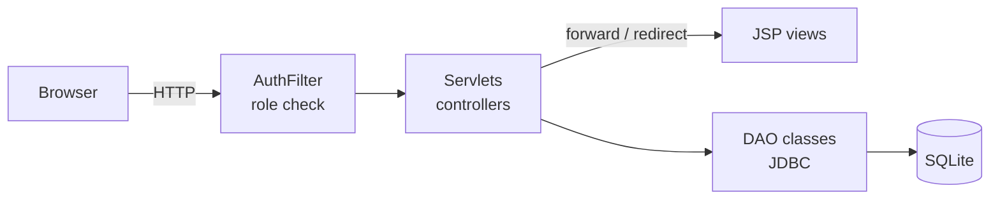

# BookNook

An online bookstore web application where customers browse, search and buy books and reading accessories, and administrators manage the catalog and user accounts.


[](LICENSE)


More screenshots: [search](docs/screenshots/search.png) · [cart](docs/screenshots/cart.png) · [order history](docs/screenshots/order-history.png) · [admin dashboard](docs/screenshots/admin-dashboard.png) · [product management](docs/screenshots/admin-products.png)

## What it does

- **Browse and search** books and accessories, and filter books by category.
- **Shopping cart** saved per account, so it is still there after logging out.
- **Checkout** creates an order, reduces stock and refuses the order if an item has run out.
- **Order history** shows past orders with the price paid for each item.
- **Admin dashboard** to add, edit and delete books, accessories, categories and customers.

## Tech stack

- **Backend:** Java 11, Jakarta Servlets and JSP (Jakarta EE 10)
- **Server:** Apache Tomcat 10.1
- **Database:** SQLite with plain JDBC
- **Security:** BCrypt password hashing
- **Build and test:** Maven, JUnit 5
- **Run:** Docker, Docker Compose

## Architecture

A server-rendered MVC application. Servlets handle requests and use DAO classes to read and write the database, and JSP pages render the HTML. Every request first passes through `AuthFilter`, which checks the user's role. On first start, the database is created from SQL scripts.



Checkout runs in a single database transaction. It creates the order, saves each item with its current price, reduces stock and empties the cart, and if any step fails nothing is saved.

UML use-case, robustness and sequence diagrams from the original design are in [`docs/diagrams`](docs/diagrams).

## Getting started

### With Docker (recommended)

```bash
docker compose up --build
```

Open <http://localhost:8080/booknook/>. The database is created with demo data on first start.

| Role | Username | Password |
|---|---|---|
| Admin | `admin` | `admin123` |
| Customer | `johnDoe` | `password123` |

### With Maven and Tomcat

Requires JDK 11+, Maven 3.9 and Apache Tomcat 10.1.

```bash
mvn package
cp target/booknook.war "$CATALINA_HOME/webapps/"
"$CATALINA_HOME/bin/catalina.sh" run
```

The database file location is set with `BOOKNOOK_DB_PATH` (default `~/.booknook/booknook.db`); see [`.env.example`](.env.example).

### Running the tests

```bash
mvn verify
```

The 27 JUnit tests run against a fresh temporary SQLite database. They cover accounts and password hashing, catalog management, the cart, checkout (including rollback when stock is too low) and the page access rules.

## Project structure

```
src/main/java/com/booknook/
├── dao/        # Database access and the checkout transaction
├── entity/     # Data classes (Book, Accessory, User, Order, ...)
├── filter/     # AuthFilter: who can open which page
├── servlet/    # One servlet per action (login, search, cart, admin)
└── util/       # HTML escaping
src/main/resources/db/   # schema.sql and seed.sql
src/main/webapp/         # JSP pages
src/test/java/           # JUnit tests
docs/                    # Screenshots and UML diagrams
```

## Technical decisions

- **Servlets and JSP without a framework**, to work directly with the request lifecycle, sessions and filters. Spring Boot would be the usual choice for a larger project.
- **Plain JDBC** keeps the SQL explicit and lets checkout manage its own transaction.
- **SQLite** needs no database server. PostgreSQL or MySQL would be needed for many concurrent users.
- **Order lines store the price at purchase**, so later price changes don't alter order history.

## License

[MIT](LICENSE) © 2025 Enea Rina
