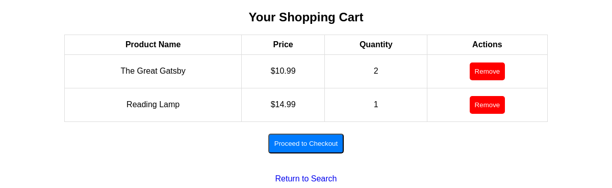
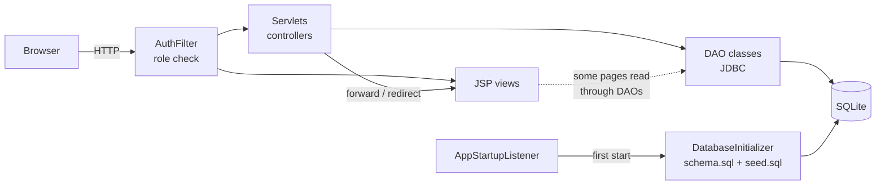

# BookNook

An online bookstore web application where customers browse, search and buy books and reading accessories, and store administrators manage the catalog and user accounts.

[](https://github.com/Eneuss/BookNook/actions/workflows/ci.yml)

[](LICENSE)



## What it does

- **Browse and search** books and accessories by title, author or name, and filter books by category.
- **Shopping cart** saved per account, so it is still there after logging out and back in.
- **Checkout** turns the cart into an order, reduces stock and refuses the order if an item has run out.
- **Order history** lists past orders with the price paid for each item.
- **Admin dashboard** to add, edit and delete books, accessories, categories and customer accounts.

## Tech stack

- **Backend:** Java 11, Jakarta Servlets 6 and JSP (Jakarta EE 10)
- **Server:** Apache Tomcat 10.1
- **Database:** SQLite through plain JDBC
- **Security:** BCrypt password hashing (jBCrypt)
- **Build and test:** Maven, JUnit 5, Spotless (palantir-java-format)
- **Delivery:** Docker, Docker Compose, GitHub Actions

## Highlights

- **Atomic checkout.** Creating the order, copying the cart lines, reducing stock and emptying the cart happen in one database transaction. Stock is only reduced when enough is left (`UPDATE ... WHERE stock >= ?`), and anything that fails rolls the whole order back ([`OrderDAO.checkout`](src/main/java/com/booknook/dao/OrderDAO.java)).
- **Prices are frozen at purchase time.** Order lines store `price_at_purchase`, so a later price change does not rewrite order history.
- **Role-based access control.** A servlet filter keeps admin pages for admins and customer pages for logged-in users. A unit test scans every servlet and JSP and fails if a new page has not been assigned an access level ([`AuthFilter`](src/main/java/com/booknook/filter/AuthFilter.java)).
- **Defences against common web attacks.** BCrypt-hashed passwords, every query that takes user input uses `PreparedStatement`, HTML-escaped output against XSS, POST-only state changes with `SameSite=Lax` cookies, and the session ID replaced at login.

---

## Getting started

### Option 1: Docker (recommended)

Prerequisite: Docker with the Compose plugin.

```bash
docker compose up --build
```

Then open <http://localhost:8080/booknook/>. On first start the database is created and loaded with demo data. It lives in the `booknook-data` volume and survives restarts.

Demo accounts (only in the seeded local database):

| Role | Username | Password |
|---|---|---|
| Admin | `admin` | `admin123` |
| Customer | `johnDoe` | `password123` |

New customers can also sign up from the Register page.

### Option 2: Maven and a local Tomcat

Prerequisites: JDK 11 or newer, Maven 3.9, Apache Tomcat 10.1.

```bash
mvn package                                   # builds target/booknook.war and runs the tests
cp target/booknook.war "$CATALINA_HOME/webapps/"
export BOOKNOOK_DB_PATH="$HOME/.booknook/booknook.db"   # optional, this is the default
"$CATALINA_HOME/bin/catalina.sh" run
```

The app is served at <http://localhost:8080/booknook/>.

### Configuration

One setting, documented in [`.env.example`](.env.example):

| Variable | Default | Purpose |
|---|---|---|
| `BOOKNOOK_DB_PATH` | `~/.booknook/booknook.db` | Path of the SQLite file. It is created and seeded if it does not exist. |

The same setting can be passed as the JVM system property `-Dbooknook.db.path=...`, which takes precedence.

### Running the tests

```bash
mvn verify
```

On JDK 17 and newer, `verify` also runs the Spotless formatting check, and `mvn spotless:apply` reformats the code. The formatter is turned off on JDK 11.

## Architecture

BookNook is a classic server-rendered MVC application. Servlets handle requests and talk to the database through DAO classes. JSP pages render the HTML. Every request first passes through `AuthFilter`. On startup, `AppStartupListener` creates the database from SQL scripts if it is missing.



**Checkout flow:** the cart page posts to `CheckoutServlet`, which calls `OrderDAO.checkout(userId)`. That method opens one connection with auto-commit off, then:

1. reads the cart lines
2. inserts the `Orders` row
3. copies the lines into `Order_Books` / `Order_Accessories` with their current prices
4. reduces stock line by line
5. clears the cart
6. commits

A `CheckoutException` (empty cart or not enough stock) rolls back and is shown on the cart page.

**Data model:** `Users`, `Categories`, `Books`, `Accessories`, `Cart`, `Orders`, `Order_Books` and `Order_Accessories` ([`schema.sql`](src/main/resources/db/schema.sql)). UML use-case, robustness and sequence diagrams from the original design are in [`docs/diagrams`](docs/diagrams).

## Project structure

```
.
├── src/main/java/com/booknook/
│   ├── dao/          # JDBC data access, DB connection and initialization, checkout transaction
│   ├── entity/       # Plain data classes (Book, Accessory, User, Order, ...)
│   ├── filter/       # AuthFilter: role-based access control
│   ├── servlet/      # One servlet per action (login, search, cart, admin CRUD) + startup listener
│   └── util/         # Html.escape for safe output
├── src/main/resources/db/   # schema.sql and seed.sql
├── src/main/webapp/         # JSP views, web.xml, Tomcat context.xml
├── src/test/java/com/booknook/   # JUnit tests (DAO layer against a temp SQLite DB, access rules, escaping)
├── docs/                    # Screenshots and UML diagrams
├── Dockerfile               # Multi-stage build: Maven -> Tomcat 10.1
├── docker-compose.yml
└── .github/workflows/ci.yml # Build, test and format check on JDK 11 and 17; Docker build
```

## Technical decisions and trade-offs

| Decision | Why | Alternative |
|---|---|---|
| Servlets and JSP, no framework | Shows how the request lifecycle, sessions and filters work underneath frameworks. | Spring Boot with Spring MVC and Spring Security would remove most of the boilerplate. |
| Plain JDBC with DAOs | SQL is explicit and easy to reason about. The checkout transaction controls its own connection. | JPA/Hibernate or jOOQ for mapping and type-safe queries. |
| SQLite | No database server to install; the database is one file. | PostgreSQL or MySQL for concurrent writes and production use. SQLite allows only one writer at a time. |
| Cart stored in the database | Survives logout and server restarts. | A session-scoped cart is simpler but is lost when the session ends. |
| One `Cart` table with `item_type` + `item_id` | One cart for two product types. | Separate cart tables per product type, or a shared `Products` table, would allow a real foreign key on `item_id`. |
| Explicit allow-lists in `AuthFilter` | Every page has a visible, tested access level. | `<security-constraint>` in `web.xml` or Spring Security. |
| BCrypt (jBCrypt) | Slow, salted hashing designed for passwords. | Argon2 or PBKDF2. |
| `Html.escape` helper in JSPs | Small fix for XSS without rewriting every page. | JSTL `<c:out>` / EL, or a template engine such as Thymeleaf that escapes by default. |
| Config via env var or system property | Works the same in Docker, Tomcat and tests. | JNDI `DataSource` configured in Tomcat. |

## Testing

`mvn verify` runs 27 JUnit 5 tests:

- **DAO tests** (`com.booknook.dao`) run against a fresh SQLite database in a temporary directory, created from `schema.sql` and `seed.sql`. They cover registration and login with hashed passwords, admin user edits, catalog CRUD and search, the cart (quantity merging, totals, users removing only their own items) and checkout (stock, price snapshot, rollback when stock is too low, empty cart).
- **Access rules** (`AuthFilterTest`): role decisions, plus a guard that every servlet and JSP is classified.
- **Output escaping** (`HtmlTest`).

The servlets and JSPs have no automated tests in this repository. They were checked by hand against a running Tomcat instance.

## Limitations and future improvements

- Some JSP pages still call DAOs in scriptlets. Moving all data loading into servlets and rendering with JSTL/EL would separate the layers cleanly.
- There are no CSRF tokens. Protection relies on POST-only state changes and `SameSite=Lax` cookies.
- SQLite does not enforce foreign keys unless `PRAGMA foreign_keys` is on, so the `ON DELETE CASCADE` rules in the schema don't run. For example, deleting a category leaves its books with no category.
- Prices are stored as floating-point `REAL`. Integer cents or `BigDecimal` would avoid rounding errors.
- Input validation is minimal. Registering with an email that is already in use returns an error page instead of a form message.
- The UI is basic HTML and CSS without pagination.
- Future work: integration tests for the servlets (for example with an embedded Tomcat), PostgreSQL support, product images, and password reset.

## License

[MIT](LICENSE) © 2025 Enea Rina
